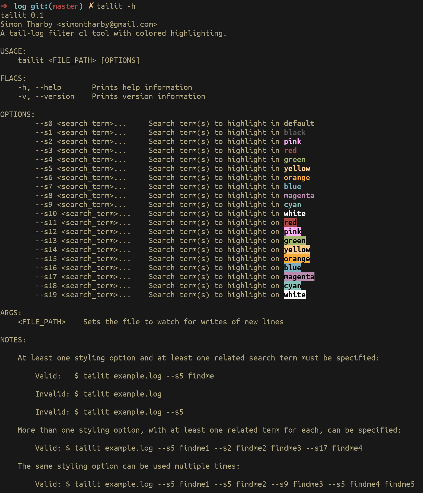

# tailit
WIP: tail-log filter cl tool, written in Rust.

## Get started:
Assuming you have [Rust](https://www.rust-lang.org/tools/install) installed...  
1. Clone the reopository: `$ git clone https://github.com/jinjagit/tailit.git` 
2. Move into the cloned repository directory: `$ cd tailit`   
3. Create a release build: `$ cargo build --release`  
4. Change to release directory: `$ cd target/release`  
5. Copy the executable to somewhere on your path. For me, this was: `$ sudo cp tailit /bin/tailit`  
6. Ensure you have permissions to execute the file, etc. E.g. `$ chmod 755 tailit`  
7. Change to a directory with a logfile you wish to monitor for changes.  
8. Run tailit with some suitable search terms for your case. E.g. `$ tailit example_file.log --s3 search_term1 --s7 search_term2`  

Output of `$ tailit -h`  
  

## Limitations:

  * Search terms are seperated by spaces in the command arguments, therefore searching for a phrase that contains spaces will not highlight matches of the whole term.
  * Different search terms that are found on the same line of a log file will result in the same line being printed more than once, each output highlighting the occurences of one of the search terms in the line.
  * Cannot, yet, specify return of n preceding &/or following lines.
